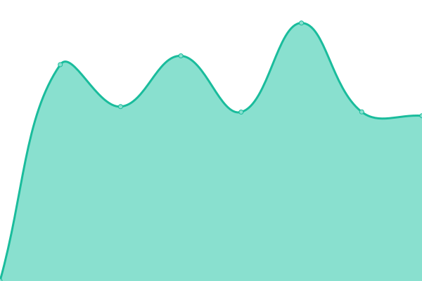

# [📈 Live Status](https://status.jmm.kr): <!--live status--> **🟩 All systems operational**

This page shows **real-time** status of the JMM website and API.

<!--start: status pages-->
<!-- This summary is generated by Upptime (https://github.com/upptime/upptime) -->
<!-- Do not edit this manually, your changes will be overwritten -->
<!-- prettier-ignore -->
| URL | Status | History | Response Time | Uptime |
| --- | ------ | ------- | ------------- | ------ |
|  [JMM.KR](https://jmm.kr) | 🟩 Up | [jmm-kr.yml](https://github.com/gwanryo/upptime/commits/HEAD/history/jmm-kr.yml) | 

 929ms
     
 | 

<a href="https://status.jmm.kr/history/jmm-kr">100.00%</a>
    

<!--end: status pages-->

[**Visit our status website →**](https://status.jmm.kr)

## 📄 License

- Code: [MIT](./LICENSE) © [Upptime](https://upptime.js.org)
- Data in the `./history` directory: [Open Database License](https://opendatacommons.org/licenses/odbl/1-0/)
